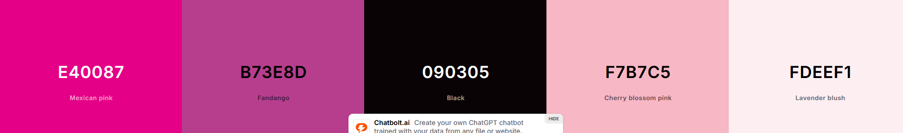
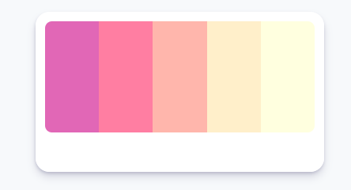

# primera opción
https://coolors.co/e40087-b73e8d-090305-f7b7c5-fdeef1

--
.color1 {color: #e40087;}
.color2 {color: #b73e8d;}
.color3 {color: #090305;}
.color4 {color: #f7b7c5;}
.color5 {color: #fdeef1;}

colores propios de flores

rgb(240, 213, 34) amarillo
rgb(37, 92, 1) verde
rgb(255, 44, 44) rojo hemorroide
rgb(251, 140, 68) naranja

# alternativa complementaria
estos colores secundarios se integran bien con los que se eligieron inicialmente.

.color1 {color: #e167b6;}
.color2 {color: #ff7ea2;}
.color3 {color: #ffb6ac;}
.color4 {color: #ffefca;}
.color5 {color: #ffffdf;}
